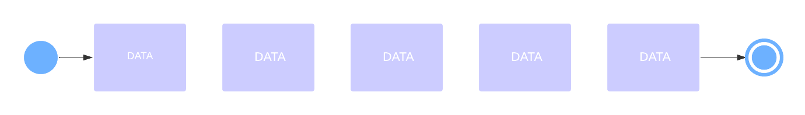

# ELC2242 - Digital Electronics & Microprocessors
## Bank Line Regulator Machine  

### Table of Contents
- [Introduction](#Introduction)  
- [Implementation](#Implementation) 
- [circuitry](#Circuit)
- [Modules](#Verilog Modules)

  
### Introduction
In banks customers are placed in a physical queue to wait for their turn.
There is a machine that regulates and preserve the order of each customer


### Implementation
Our Machine is implemented using verilog hardware description language and written on FPGA board with the logic of queue
(FIFO) to organize people entry and turns.



Queue follows the FIFO (First In First Out) method and is open at both of its ends. Data insertion is done at one end 
rear end or the tail of the queue while deletion is done at the other end called the front end or the head of the queue. 


### Circuit

- #### Synchronous FIFO
    
    The type of FIFOs which have common write and read clock are called synchronous FIFO. Synchronous 
    FIFOs are very common in a processor/controller ICs which work on a common system clock. Since all the sub-systems work
    on the same system clock they can make use of sync-FIFOs with a possible need for skew handling.

    

    The circuit is divided into:
  - Write Enable
  - Write Pointer
  - Memory
  - Read Enable
  - Read Pointer
  - Read Comparator
  - Write Comparator

### Verilog Modules

- Writer Pointer

```verilog
 module write_pointer(wptr,fifo_we,wr,fifo_full,clk,rst_n);  
```

- Read Pointer

```verilog
 module read_pointer(rptr,fifo_rd,rd,fifo_empty,clk,rst_n);  
```
- Memory

```verilog
module memory_array(data_out, data_in, clk,fifo_we, wptr,rptr); 
```

```verilog
module fifo_mem(seg1,seg2,fifo_full, fifo_empty, fifo_threshold, fifo_overflow, fifo_underflow,clk, rst_n, wr, rd, data_in,input1,input2); 
 ```

- State Checker
```verilog
 module status_signal(fifo_full, fifo_empty, fifo_threshold, fifo_overflow, fifo_underflow, wr, rd, fifo_we, fifo_rd, wptr,rptr,clk,rst_n);  
```

- Decimal to BCD Encoder
```verilog
 module decimal_bcd_encoder(
    input [9:0] d,
    output reg [3:0] y
    );
```

- 7 Segments Decoder
```verilog
module segment7(bcd, seg);
```